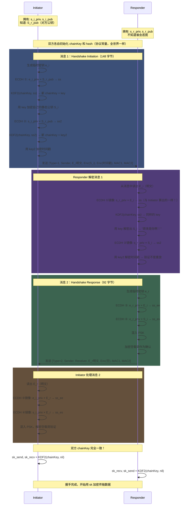
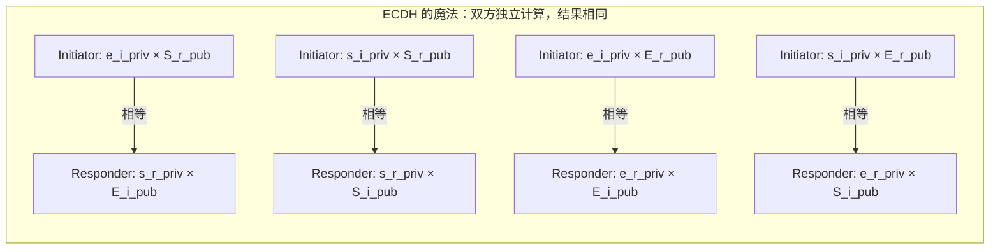
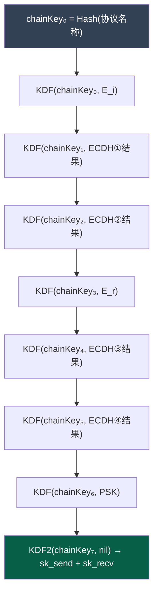

# WireGuard Noise_IK 握手流程图

## 握手全景

```mermaid
sequenceDiagram
    participant I as Initiator
    participant R as Responder

    Note over I: 拥有: s_i_priv, s_i_pub<br/>知道: S_r_pub（对方公钥）
    Note over R: 拥有: s_r_priv, s_r_pub<br/>不知道谁会连我

    Note over I,R: 双方各自初始化 chainKey 和 hash（协议常量，全世界一样）

    rect rgb(60, 80, 120)
        Note over I,R: 消息 1：Handshake Initiation（148 字节）
        I->>I: 生成临时密钥 e_i
        I->>I: ECDH ①: e_i_priv × S_r_pub → ss
        I->>I: KDF2(chainKey, ss) → 新 chainKey + key
        I->>I: 用 key 加密自己的静态公钥 S_i
        I->>I: ECDH ②: s_i_priv × S_r_pub → ss2
        I->>I: KDF2(chainKey, ss2) → 新 chainKey + key2
        I->>I: 用 key2 加密时间戳
        I->>R: 发送 [Type=1, Sender, E_i明文, Enc(S_i), Enc(时间戳), MAC1, MAC2]
    end

    rect rgb(80, 60, 120)
        Note over I,R: Responder 解密消息 1
        R->>R: 从消息中读出 E_i（明文）
        R->>R: ECDH ①镜像: s_r_priv × E_i → ss（与 Initiator 算出的一样！）
        R->>R: KDF2(chainKey, ss) → 同样的 key
        R->>R: 用 key 解密出 S_i → "原来是你啊！"
        R->>R: ECDH ②镜像: s_r_priv × S_i → ss2
        R->>R: 用 key2 解密时间戳 → 验证不是重放
    end

    rect rgb(60, 100, 80)
        Note over I,R: 消息 2：Handshake Response（92 字节）
        R->>R: 生成临时密钥 e_r
        R->>R: ECDH ③: e_r_priv × E_i → ss_ee
        R->>R: ECDH ④: e_r_priv × S_i → ss_es
        R->>R: 混入 PSK
        R->>R: 加密空载荷作为确认
        R->>I: 发送 [Type=2, Sender, Receiver, E_r明文, Enc(空), MAC1, MAC2]
    end

    rect rgb(100, 80, 60)
        Note over I,R: Initiator 处理消息 2
        I->>I: 读出 E_r（明文）
        I->>I: ECDH ③镜像: e_i_priv × E_r → ss_ee
        I->>I: ECDH ④镜像: s_i_priv × E_r → ss_es
        I->>I: 混入 PSK，解密空载荷验证
    end

    Note over I,R: 双方 chainKey 完全一致！

    I->>I: sk_send, sk_recv = KDF2(chainKey, nil)
    R->>R: sk_recv, sk_send = KDF2(chainKey, nil)

    Note over I,R: 握手完成，开始用 sk 加密传输数据
```

## 4 次 ECDH 与"镜像计算"

```mermaid
graph LR
    subgraph "ECDH 的魔法：双方独立计算，结果相同"
        A1["Initiator: e_i_priv × S_r_pub"] -->|相等| B1["Responder: s_r_priv × E_i_pub"]
        A2["Initiator: s_i_priv × S_r_pub"] -->|相等| B2["Responder: s_r_priv × S_i_pub"]
        A3["Initiator: e_i_priv × E_r_pub"] -->|相等| B3["Responder: e_r_priv × E_i_pub"]
        A4["Initiator: s_i_priv × E_r_pub"] -->|相等| B4["Responder: e_r_priv × S_i_pub"]
    end
```

## chainKey 进化链

```mermaid
graph TD
    CK0["chainKey₀ = Hash(协议名称)"] --> CK1
    CK1["KDF(chainKey₀, E_i)"] --> CK2
    CK2["KDF(chainKey₁, ECDH①结果)"] --> CK3
    CK3["KDF(chainKey₂, ECDH②结果)"] --> CK4
    CK4["KDF(chainKey₃, E_r)"] --> CK5
    CK5["KDF(chainKey₄, ECDH③结果)"] --> CK6
    CK6["KDF(chainKey₅, ECDH④结果)"] --> CK7
    CK7["KDF(chainKey₆, PSK)"] --> FINAL
    FINAL["KDF2(chainKey₇, nil) → sk_send + sk_recv"]

    style CK0 fill:#334155,color:#fff
    style FINAL fill:#065f46,color:#fff
```
