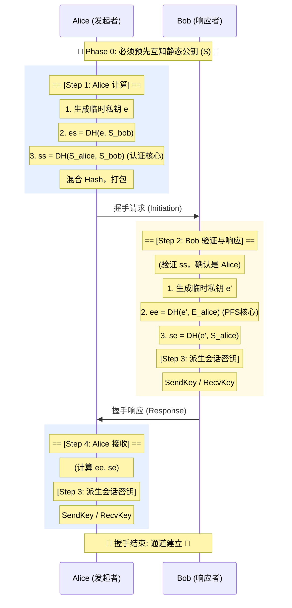

# WireGuard 协议核心深究：密钥交换与 Noise_IK

本文档详细记录了 WireGuard 如何通过 Noise_IK 协议实现极致的安全握手。重点阐述了握手过程中的**前置条件**以及核心的**4次 ECDH 计算**。

## 核心设计哲学
WireGuard 的安全性建立在 **"熟人网络"** 的基础上。它不像 HTTPS 那样依赖 CA 证书来信任陌生人，而是依赖**预先配置的静态公钥**。

握手协议 (Handshake) 的终极目标是：在不安全的网络上，基于已知的静态身份，协商出一对**临时的、前向保密的 (PFS)** 对称密钥 (`SendKey` / `RecvKey`)。

---

## 阶段 0：前置信任建立 (Prerequisite)
> **"没有这一步，后面的一切都不会发生。"**

这是经常被忽略但至关重要的一步。
1.  **公钥互换**：Alice 必须预先将被告知 Bob 的静态公钥 (`Static_Bob`)；Bob 也必须预先被告知 Alice 的静态公钥 (`Static_Alice`)。
2.  **配置生效**：双方将对方的公钥写入配置文件或内存 (`Known Peers`)。

如果一方不认识另一方的公钥，握手请求会被**直接丢弃 (Silent Drop)**，不会有任何错误回执。这也是 WireGuard 抗扫描、隐身特性的来源。

---

## 阶段 1-3：握手全流程 (The Handshake)

WireGuard 仅需 **1-RTT (一次往返)** 即可完成握手。在这个过程中，双方在后台默默完成了 **4次 核心 ECDH 计算**，将身份与时间紧密交织。

### 步骤 1：Alice 发起 (Initiator)
Alice 生成临时私钥 `e` (Ephemeral) 及其对应的 **临时公钥 `E_pub`**，开始计算：

| 计算序号 | 原料A (自己·私) x 原料B (对方·公) | 计算公式 (DH) | 目的 |
| :--- | :--- | :--- | :--- |
| **DH #1** | `Alice临时私钥` x `Bob静态公钥` | `es = DH(e_priv, S_bob_pub)` | **问路**：加密静态公钥，初步隐藏身份。 |
| **DH #2** | `Alice静态私钥` x `Bob静态公钥` | `ss = DH(S_alice_priv, S_bob_pub)` | **认证 (Auth)**：证明"我持有Alice私钥"。只有真正的 Alice 能算对。 |

*Alice 发送：`msg = { E_pub, Encrypted(Static, AuthTag) }`*

### 步骤 2：Bob 响应 (Responder)
Bob 收到包，验证通过后，生成临时私钥 `e'` 及其对应的 **临时公钥 `E'_pub`**，继续计算：

| 计算序号 | 原料A (自己·私) x 原料B (对方·公) | 计算公式 (DH) | 目的 |
| :--- | :--- | :--- | :--- |
| **DH #3** | `Bob临时私钥` x `Alice临时公钥` | `ee = DH(e'_priv, E_alice_pub)` | **前向保密 (PFS)**：两个临时钥匙碰撞，生成仅存于当下的秘密。用完即焚。 |
| **DH #4** | `Bob静态私钥` x `Alice临时公钥` | `se = DH(S_bob_priv, E_alice_pub)` | **绑定**：确认刚才的临时工确实是 Alice 派来的。 |

*Bob 发送：`msg = { E'_pub, Encrypted(Empty, AuthTag) }`*

### 步骤 3：密钥达成 (Key Derivation)
当 Bob 发出响应，且 Alice 收到响应后，双方手里都拥有了完全一致的 4 个 DH 结果链。
通过 HKDF 算法，将这根链条分裂 (Split)：
*   **SendKey**
*   **RecvKey**

此后，所有数据包使用这两个密钥进行 ChaCha20Poly1305 加密。

---

## 为什么要算 4 次？ (The "Why")

这 4 次计算缺一不可，构成了安全性的**"三位一体"**：

1.  **身份认证 (Authentication)**
    *   靠 `ss` (Static-Static) 和 `se` 保证。
    *   防止中间人攻击 (MITM)。
2.  **前向保密 (PFS - Perfect Forward Secrecy)**
    *   靠 `ee` (Ephemeral-Ephemeral) 保证。
    *   即使未来长期私钥泄露，历史流量也无法解密。
3.  **防重放 (Anti-Replay)**
    *   靠 `ee` 和 Hash 中的 Counter 保证。
    *   防止攻击者录制旧的握手包来欺骗服务器。

---

## 流程图 (Sequence Diagram)

