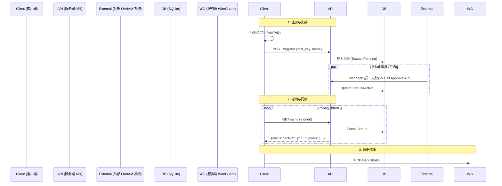

# SimpleLink 服务端技术架构设计文档

## 1. 核心设计理念

服务端 (Control Plane) 是整个系统的"大脑"，负责身份认证、IP 地址管理 (IPAM) 以及向数据平面 (Data Plane) 下发配置。
服务端采用 **All-in-One** 设计，将 API 服务、数据库、管理后台、WireGuard 控制器打包为一个单一的 Go 二进制文件。

**核心原则：**
*   **零外部依赖**：使用嵌入式数据库 (SQLite)，真正实现"单文件部署"，无需复杂的 MySQL/Redis 依赖。
*   **API First (集成友好)**：所有功能（审批、管理、鉴权）均通过 REST API 暴露，旨在轻松集成到企业现有的 Web 系统（OA/CMDB/工单平台）。
*   **无状态 API**：基于公私钥签名鉴权，天然支持水平扩展与自动化集成。
*   **声明式配置**：服务端作为"Source of Truth"，客户端通过轮询同步状态。

---

## 2. 技术栈选型 (Tech Stack)

### 2.1 核心服务 (Server)
*   **语言**: Golang (1.21+)
*   **Web 框架**: **Gin** (高性能 REST API)
*   **数据库**: **SQLite** (via `go-sqlite3` 或纯 Go 的 `modernc.org/sqlite`)
*   **ORM**: **GORM** (负责模型映射与迁移)
*   **Admin UI**: Vue 3 (同客户端技术栈)，编译后 `embed` 进 Go 二进制。

### 2.2 协议交互 (Protocol)
*   **UAPI 控制**: 使用 `device.IpcSet()` 通过 Unix Domain Socket 控制本地 WireGuard 接口。
*   **客户端通信**: HTTPS + JSON。
*   **鉴权机制**: **Ed25519 签名**。客户端使用 WireGuard 私钥对 API 请求进行签名，服务端使用存储的公钥验签。

---

## 3. 核心模块设计

### 3.1 数据库设计 (Schema)

```sql
-- 设备表
CREATE TABLE devices (
    id INTEGER PRIMARY KEY AUTOINCREMENT,
    machine_id TEXT UNIQUE,      -- 客户端硬件指纹
    public_key TEXT UNIQUE,      -- WireGuard 公钥 (核心身份标识)
    name TEXT,                   -- 用户定义的设备名 (如 "John's MacBook")
    ip_address TEXT,             -- 分配的 VPN 内网 IP (如 "10.0.0.2")
    status TEXT,                 -- pending | active | rejected | expired
    last_seen_at DATETIME,       -- 最后一次心跳时间
    expired_at DATETIME,         -- 密钥过期时间
    created_at DATETIME DEFAULT CURRENT_TIMESTAMP
);

-- 全局设置表
CREATE TABLE settings (
    key TEXT PRIMARY KEY,
    value TEXT
    -- 包含: vpn_cidr (10.0.0.0/24), endpoint_url, key_rotation_days 等
);
```

### 3.2 IPAM (地址管理)
*   **策略**: **顺序分配 + 稀疏回收**
*   **逻辑**: 
    1.  初始化根据 `vpn_cidr` (e.g., 10.0.0.0/24) 构建 IP 池。
    2.  新设备注册：`SELECT next_available_ip`。
    3.  设备删除/过期：释放 IP。
    4.  **冲突检测**: 分配前强制检查 `devices` 表。

### 3.3 配置下发与集成 (Configuration & Integration)

#### A. 客户端同步 (Polling)
*   **模式**: Client-Side Polling (客户端轮询)。周期默认 60s。
*   **逻辑**: 客户端 `GET /sync` (带签名)，服务端返回最新 Peer 列表。

#### B. 系统集成能力 (Integration Capabilities)
这是 SimpleLink 的核心优势之一，旨在打破信息孤岛：

1.  **IAM/SSO 集成 (鉴权层)**
    *   **OIDC/LDAP 支持**: 服务端预留 `AuthProvider` 接口。企业可配置让管理员登录 Dashboard 时走公司统一的 Okta/AD/LDAP 认证。
    *   **免密注册**: 如果是在企业受信任网络内，或通过内部 Portal 跳转过来（带 Token），可实现客户端免审批自动注册。

2.  **API 自动化控制 (管理层)**
    *   **HR/OA 联动**: 开放 `POST /api/v1/admin/device/{id}/approve` 等接口。
    *   **场景**: 员工入职流程在 OA 审批通过后，OA 系统直接调用 API 自动批准该员工的 VPN 设备请求；离职时自动调用 API 吊销证书。

3.  **审计与监控 (数据层)**
    *   **Webhook 推送**: 支持配置 Webhook URL。当发生 `DeviceConnected`, `DeviceApproved`, `KeyExpired` 等事件时，向外部系统（如飞书/钉钉/ELK）推送 JSON Payload。
    *   **Prometheus Metrics**: 暴露 `/metrics` 接口，供 Grafana 采集 VPN 在线人数、流量吞吐等指标。

---

## 4. 系统架构交互图



---

## 5. 安全设计 (Security)

1.  **最小权限原则**: 服务端不存储客户端私钥。
2.  **Web 安全**: API 强制 HTTPS。
3.  **设备隔离**: 默认开启防火墙规则，禁止 Client 互通，除非策略允许。

---

## 6. 部署形态

*   **Docker**: 标准容器化部署，参数透传。
*   **Binary (裸机)**: 单文件运行，零依赖。
*   **Kubernetes Sidecar**: 可作为业务 Pod 的 Sidecar 运行，为业务容器提供透明的内网穿透能力（无需配置 Ingress）。
